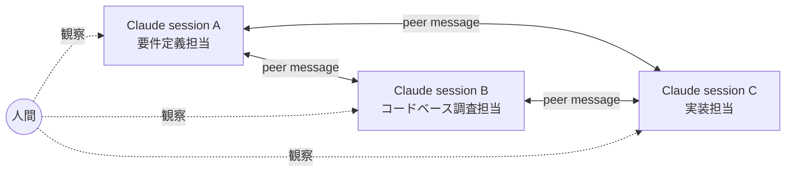

## はじめに

Claude Code を使い込んでいると、いつしか **subagents（サブエージェント）** にタスクを投げる運用が「当たり前」になります。

- コードベースの調査
- 実装の一部
- 要件定義のたたき台作成

このあたりを `Agent` ツールで切り出して並列に走らせる、というのは確かに効率的です。ただ、しばらく運用していて「これ、本当に subagent でやるのが最適なんだっけ？」と引っかかる場面が増えてきました。

例えるなら、**subagent は「Uber Eats で注文した料理」** です。早いし便利。でも、毎日同じ店に頼んでいるのに、店員は毎回「いらっしゃいませ、ご注文は？」と聞いてくる。常連の好みは記録されない。
一方で、これから話す peer は **「行きつけの定食屋のカウンター」** に近い。大将はあなたの常連としての文脈を持っていて、横にいる別の常連と勝手に会話して、勝手に問題を解決してくれることすらある。

本記事では、**subagent の限界** を整理した上で、代替手段として **`claude-peers-mcp`** によるセッション同士の peer 対話を提案します。

## subagent の便利さと、引っかかる点

### 便利な点

subagent は、

- 親セッションのコンテキストを汚さずに調査ができる
- 検索結果やビルドログのような **巨大な中間出力をフィルタしてサマリだけ親に返す** ことができる
- 並列に投げられるので時短になる

という意味で、「ノイズを遮断するためのフィルタ」として優秀です。
イメージで言うと、**コーヒーフィルター** みたいなものです。豆（生ログ）を直接親に流したらドロドロになるところを、subagent が一度濾過してくれて、澄んだ一杯だけが親のカップに注がれる。

### でも、引っかかる点

一方で、subagent を多用すると以下のような違和感が出てきます。

1. **コンテキストが結局親に集約される**
   subagent はタスク終了時に「最終結果」を親に返して消えます。親セッションだけが文脈を保持しているので、結局すべてが親に流れ込む構造です。
   要は **王様一人の机に全部隊の戦況報告が積み上がる構図**。フィルタしたつもりでも、フィルタ後の紙束で結局机が埋まる。

2. **要件定義・コードベース調査は本来「文脈を維持しているセッション」でやるべき**
   要件定義のような往復が必要なタスクを subagent に丸投げすると、subagent は親の会話履歴を知りません。毎回プロンプトで状況を渡す必要があり、これが地味に重い。
   **結婚相談を毎回違うカウンセラーに、毎回ゼロから自分の人生を説明してやり直す** ような感覚。3 回目には説明する側が疲弊します。

3. **人間がレビュー & 中継すると遅い**
   「subagent A の結果を見て、それを踏まえて subagent B に依頼する」という流れを人間が中継すると、せっかくの並列性が活きません。かといって人間を抜くと、A の結果を B が正しく受け取れる保証もない。
   **伝言ゲームの真ん中に正座させられた幹事** 状態。並列で投げたはずなのに、人間がボトルネックになって直列に戻る。

つまり subagent は、

> **使い捨ての調査タスクには強いが、文脈を持ったセッション同士の協調作業には向いていない**

という構造的な弱点を持っています。
言い換えると、**subagent はティッシュ、peer はハンカチ**。一度きりで捨てるならティッシュが楽だけど、何度も使う関係性なら、洗って育てるハンカチの方が結局気持ちいい。

## 提案: `claude-peers-mcp` でセッション同士を会話させる

ここで使いたいのが `claude-peers-mcp` です。

これは Claude Code の MCP サーバとして動作し、**同じマシン上で起動している複数の Claude Code インスタンスを互いに発見・メッセージング可能にする** ものです。

ざっくり言えば、**自分のターミナルの中に「フリーアドレスのオフィス」を作る** ような感覚。各タブ（セッション）が一人の同僚で、相手の席まで歩いていって「これどう思う？」と聞ける関係になります。

### イメージ

各セッションは **それぞれ独立した文脈** を保ったまま、必要なときだけ peer 経由で会話できます。

### 使えるツール

`claude-peers-mcp` が提供する主なツールは以下です。

| ツール | 役割 |
| ---- | ---- |
| `list_peers` | 同マシン上の他のセッションを発見する |
| `send_message` | 相手のセッションIDを指定してメッセージを送る |
| `set_summary` | 自分が今何をやっているか 1〜2 文で公開する |
| `check_messages` | 受信したメッセージを確認する |

`set_summary` は地味ですが超重要で、これがあるおかげで「あ、隣のセッションは要件定義をやってるんだな」と互いに把握できます。
要するに **席の上に立てた三角POP**。「商談中」「集中タイム」「相談OK」みたいなステータスが見えるだけで、無駄な割り込みが激減します。

## subagent と peer、どう使い分けるか

両者を排他的に捉える必要はありません。役割が違います。

| 観点 | subagent | peer |
| ---- | ---- | ---- |
| 文脈 | 使い捨て（毎回ゼロから） | セッションごとに維持 |
| 通信方向 | 親 → 子 → 親（一方向） | 双方向・非同期 |
| 寿命 | タスク終了で消える | 人間が閉じるまで生存 |
| 向いている仕事 | 大量ファイル走査・ログ要約・並列調査 | 要件定義の往復・設計議論・相互レビュー |
| 並列性 | 親が複数同時に投げられる | 各セッションが対等に並列 |

ざっくり言うと、

- **読んで捨てるもの** → subagent
- **覚えておきたいもの・育てるもの** → peer

という分け方です。

別の言い方をすれば、

- subagent は **「探偵社に出す調査依頼書」**: 報告書は受け取れるが、探偵はあなたの会社の事情を覚えていない
- peer は **「専属の弁護士・税理士チーム」**: 普段から事情を知っていて、互いに連絡を取り合って動いてくれる

そう考えると、「全部 subagent でやればよくない？」という発想が、いかに **顧問契約をやめて毎回スポットで依頼するスタイル** に近いか、しみじみ伝わります。

## こういう使い方が嬉しい

具体的なシナリオを 3 つ。

### 1. 要件定義 ↔ 実装 の二窓構成

要件を詰めるセッション A と、実装するセッション B を立てて、

- A: 仕様の曖昧な点を見つけたら B に「この API の現状の挙動どうなってる？」と聞く
- B: 実装中に仕様の解釈で迷ったら A に「この場合の期待値は？」と確認する

人間は両方を眺めながら、必要なときだけ口を挟むだけで進みます。

### 2. コードベース調査担当を常駐させる

セッション C を「コードベース Q&A 専用」にしておき、`set_summary` でその旨を宣言。
他のセッションは大規模なgrepや構造調査が必要になったら C に投げる。C は調査結果と一緒に **背景的な知識** も育っていくので、subagent の使い捨て調査より精度が上がっていきます。

イメージとしては **チームに一人いる「コードベースの主」**。新人が入ってくるたびに「あれ、あの認証ロジックどこだっけ」と聞ける先輩。subagent は「Stack Overflow に毎回投稿する」ようなものだとすると、peer の常駐調査担当は「2 列前のあの先輩」です。質問の度に名前を覚えてもらえる安心感があります。

### 3. 相互レビュー

セッション A が書いたコードを、独立した文脈のセッション B に peer 経由で渡してレビューしてもらう。
A の思考バイアスに引きずられないレビューが得られます。これは subagent でもできますが、**B 側にもレビュー観点の蓄積が残る** のが peer の利点です。

## 注意点

良いことばかりではないので、現時点で気をつけたい点も。

- **同じマシン上のセッションに限定される**
  リモート間の peer 通信は（執筆時点では）スコープ外。
- **メッセージは「肩を叩かれる」感覚で割り込む**
  受信側は作業を中断して即応する設計なので、ノイズが多いとお互いに集中を切らす。`set_summary` で「今ここ集中したいフェーズ」を明示するなどの運用工夫が必要。
- **人間がトポロジを設計する必要がある**
  「A は要件定義」「B は実装」のような役割分担は、最初に人間が決めて各セッションに伝える必要があります。ここを雑にすると全員が同じ仕事をし始めます。
  役者を 3 人揃えただけで台本を渡し忘れると、**全員が勝手にハムレットを始める** ようなもの。人間は「監督」のポジションを引き受ける覚悟が要ります。

## まとめ

- subagent は **使い捨て調査** には強いが、**文脈を持った協調作業** には向かない
- `claude-peers-mcp` を使えば、**文脈を保ったセッション同士** を peer として会話させられる
- 「読んで捨てる」は subagent、「育てる・覚えておく」は peer、と役割を分けるとスッキリする

並列で投げる前に、「これは捨てる調査か、それとも育てたい対話か？」を一度自問する。これだけで Claude Code との付き合い方がだいぶ変わります。

最後に一つだけ。subagent を多用していると、知らないうちに **「自分一人で全員分の会議の議事録を書いている部長」** になっています。Claude Code を効率化したつもりが、いつの間にか親セッション（＝あなたの目の前のターミナル）が一番疲弊している。
peer は、その部長の隣に同僚を座らせて、**「ちょっとそれ、君らで話して結論だけ持ってきて」** と言えるようにする仕組みです。

要するに、**Claude を一人雇うんじゃなくて、チームを組ませる**。
そういう発想の切り替えだと思って、ぜひ一度試してみてください。

## 参考

- `claude-peers-mcp`（MCP サーバ。インストール手順・公式リポジトリは適宜検索のうえご参照ください）
- Claude Code 公式ドキュメント: subagents / Agent ツール
